# DSHBRD

- An interactive, customizable virtual social assistant.
- The driving concept behind this project was that there is now an app for everything a person can think of, but a user needs to have so many different apps downloaded in order to get all the information he or she needs. DSHBRD is meant to save you time by keeping everything in one place.
- Utilities:
  - Weather
  - Full Calendar
  - News, customized to the users selected news sources
  - Events (concerts and sporting events) in the area, based on user location.
  - Restaurants in the area
  - A google map that plots all the events and restaurants near you

## Technologies Used:

- React.js
- React Router
- Node.js
- Express.js
- PostgreSQL
- PG-Promise(SQL queries)
- CSS3

## Libraries & Modules:

- React Google Maps
- React Big Calendar
- React Swipeable Routes
- Moment.js

## API Services

- OpenWeatherMap API
- News API
- TicketMaster API
- Zomato API
- Google Maps API

## Contributors:

- Lorenzo Salvio: Full Stack Development

## Home Page

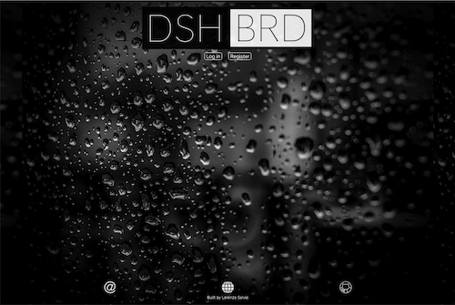
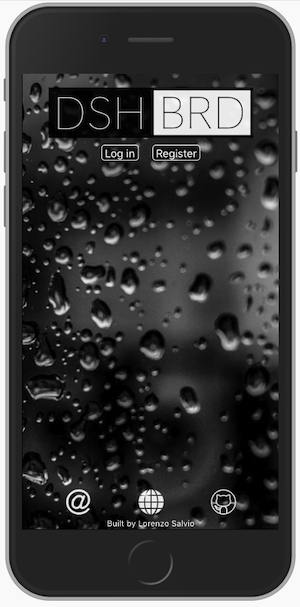

- Users login with a simple combination of the email associated with your account and a password.
- New users can sign up for a new account with just a name, email account and password.

## User Dashboard

### Daily Briefing

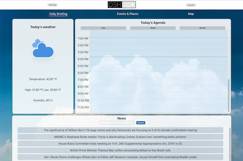
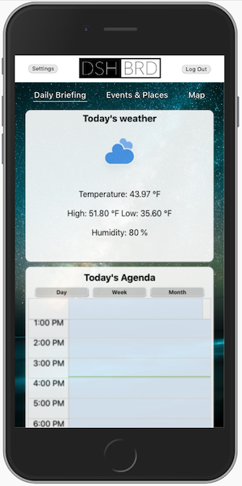

- The user is greeted with the weather based on location services, their fully customized calendar, and a stream of news headlines.
  - Users can add, edit and remove events at will.
  - Users can add their preferred news sources to the user preferences page, allowing them to build a personalized news stream.

### Events & Places

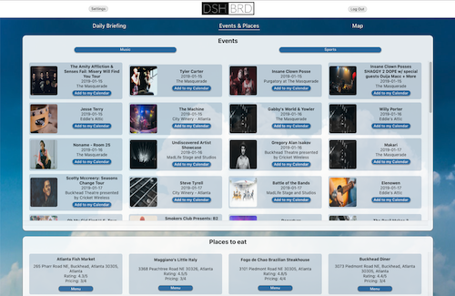
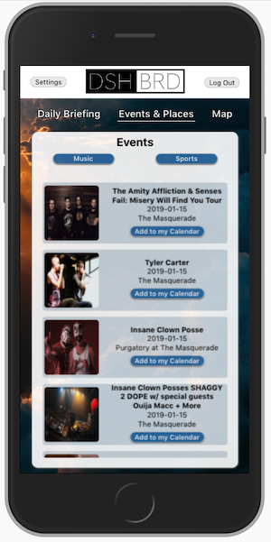

- Events and Places lists are populated by information from the area that a user is in.
  - Each item in the events list contains a link to purchase tickets to that events, information on the venue, and a button to add the event to your calendar in the Daily Briefing section.
  - Each item in the Places list contains a link to the menu online, as well as average review score and a pricing index.

### Map

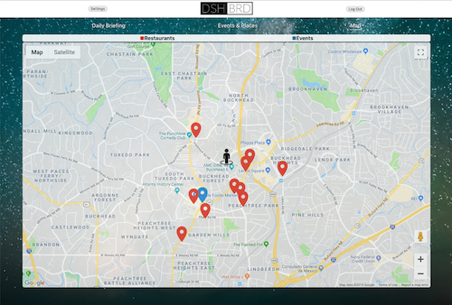
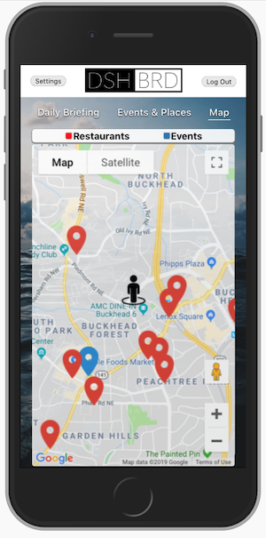

- Markers are placed on the map based on coordinates of the events and restaurants.
- When the red markers are clicked, a pop-up info window displays the ratings, pricing and distance of restaurants.
- When the blue markers are clicked, a pop-up info window displays name and distance of the event.

## Settings

### User Information

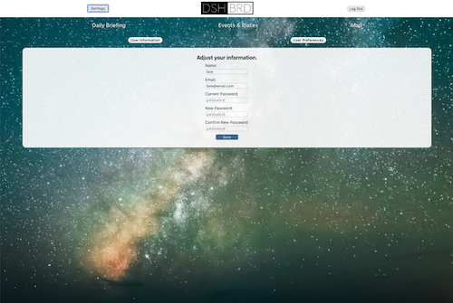
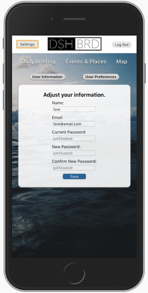

- Users can easily modify any of the information that is associated with their account through this simple form.

### User Preferences

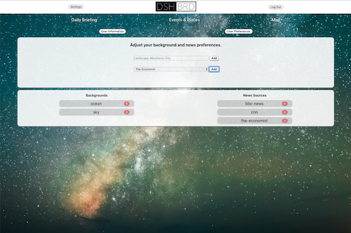
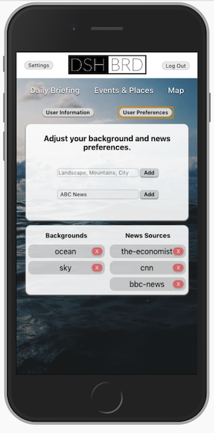

- A user can add keywords to a list to be random selected to generate the background dynamically. If no values are entered, the keyword "space" is used.
- A user can select from a long list of news sources to populate their news stream.
